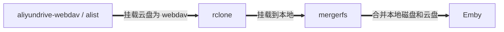

- [🌟 云盘挂载 🌟](#-云盘挂载-)
  - [🐳 简介](#-简介)
  - [👨‍💻 安装](#-安装)
    - [☁️ 1. 安装 aliyundrive-webdav / alist](#️-1-安装-aliyundrive-webdav--alist)
    - [🪝 2. 安装 rclone](#-2-安装-rclone)
    - [🤖 3. 安装 mergerfs](#-3-安装-mergerfs)
    - [👻 4. 拉取项目并配置](#-4-拉取项目并配置)
      - [4.1. 拉取](#41-拉取)
      - [4.2. 配置](#42-配置)
    - [😉 5. 挂载和开机自启](#-5-挂载和开机自启)
      - [5.1. 挂载](#51-挂载)
      - [5.2. 开机自启](#52-开机自启)
        - [5.2.1. systemctl](#521-systemctl)
        - [5.2.2. rc.local](#522-rclocal)
    - [🤗 6. 添加定时上传任务](#-6-添加定时上传任务)
  - [👏 相关仓库](#-相关仓库)
  - [😘 如何贡献](#-如何贡献)
  - [🃏 使用许可](#-使用许可)

# 🌟 云盘挂载 🌟

## 🐳 简介

> 本项目是个人使用的云盘挂载方案，方便配合 [automatic-theater](https://github.com/LuckyPuppy514/automatic-theater)，实现上传云盘以及观看云盘中的内容

本项目的大致思路



采用 mergerfs 相较于只使用 rclone 的优点

- 增减目录或硬盘，无需每个系统逐一设置，只需修改 mergerfs 配置即可
- 下载后保留一段时间后再定时上传，可提供时间给 Emby 刮削以及用户观看
- 定时上传采用 rclone move，无需写入缓存目录，少一次硬盘读写损耗
- 配合排除文件，可以自由选择需要同步或不同步的目录，文件

## 👨‍💻 安装

### ☁️ 1. 安装 aliyundrive-webdav / alist

> 只使用阿里云盘建议使用 aliyundrive-webdav，其他云盘或者多云盘，可使用 alist

[alist 官方文档](https://alist-doc.nn.ci/docs/intro)

[aliyundrive-webdav 官方文档](https://github.com/messense/aliyundrive-webdav#%E5%AE%89%E8%A3%85)

官方文档都较为详细，请自行查阅并安装，这里提供我的 docker-compose 配置供参考

```bash
version: "3"
services:
  aliyundrive:
    image: messense/aliyundrive-webdav
    container_name: aliyundrive
    ports:
      - 9090:8080
    environment:
      - REFRESH_TOKEN=${ALIYUNDRIVE_REFRESH_TOKEN}
      - WEBDAV_AUTH_USER=${ALIYUNDRIVE_WEBDAV_AUTH_USER}
      - WEBDAV_AUTH_PASSWORD=${ALIYUNDRIVE_WEBDAV_AUTH_PASSWORD}
    restart: unless-stopped

  alist:
    image: xhofe/alist:latest
    container_name: alist
    ports:
      - 5244:5244
    environment:
      - TZ=Asia/Shanghai
    volumes:
      - ${CONFIG_PATH}/alist:/opt/alist/data
    restart: unless-stopped
```

### 🪝 2. 安装 rclone

```bash
curl https://rclone.org/install.sh | sudo bash
```

[官方安装文档](https://rclone.org/install/)

### 🤖 3. 安装 mergerfs

支持 apt 的系统：ubuntu / debian / ......

```bash
sudo apt update && sudo apt-get install mergerfs && sudo apt install fuse
```

其他系统请自行查找安装方式，或参考：[官方安装文档](https://github.com/trapexit/mergerfs#build--update)

### 👻 4. 拉取项目并配置

#### 4.1. 拉取

```bash
git clone https://github.com/LuckyPuppy514/cloud-drive.git
```

#### 4.2. 配置

获取 rclone 加密后的密码

```bash
echo "你的 webdav 密码" | rclone obscure -
```

修改 /cloud-drive/rclone-mergerfs/config/rclone.config

```text
[云盘名称]
type = webdav
url = http://ip:端口号
vendor = other
user = webdav 用户名
pass = webdav 加密后的密码
```

按注释修改 /cloud-drive/rclone-mergerfs/config/rclone-mergerfs.config 基础配置，进阶配置可按需修改

```text
# 基础配置
# 云盘路径
CLOUD_PATH=云盘名称:/
# 挂载路径
MOUNT_PATH=/mnt/云盘名称
# 缓存路径
CACHE_DIR=/mnt/local/.cache
# 本地磁盘路径
LOCAL_PATH=/mnt/local
# 合并后路径
MERGERFS_PATH=/mnt/mergerfs
# 用户ID和组ID
PUID=1000
PGID=1000
# 保存在本地磁盘的时间（创建时间大于 MIN_AGE 才会上传）
MIN_AGE=3d
...
```

### 😉 5. 挂载和开机自启

#### 5.1. 挂载

给脚本添加可执行权限，在 /cloud-drive/rclone-mergerfs 目录下执行

```bash
sudo chmod +x *.sh
```

挂载

```bash
sudo ./mount.sh
```

查看挂载是否成功

```bash
ls -l 你挂载的路径
```

卸载挂载

```bash
sudo ./unmount.sh
```

#### 5.2. 开机自启

> 这里提供 systemctl 以及 rc.local 的自启动方案，不支持的系统请自行寻找开机自启方案 🥲

##### 5.2.1. systemctl

修改 /cloud-drive/rclone-mergerfs/rclone-mergerfs.service 中的 cloud-drive 路径

```bash
[Unit]
Description=RClone Mergerfs Service
Wants=network-online.target
After=network-online.target

[Service]
Type=forking
KillMode=process
RestartSec=5
Restart=on-failure
User=root
Group=root
WorkingDirectory=/docker/cloud-drive/rclone-mergerfs
ExecStart=/docker/cloud-drive/rclone-mergerfs/mount.sh
ExecStop=/docker/cloud-drive/rclone-mergerfs/unmount.sh

[Install]
WantedBy=multi-user.target
```

添加开机启动，在 /cloud-drive/rclone-mergerfs/ 目录下执行

```bash
sudo cp rclone-mergerfs.service /etc/systemd/system/ && sudo systemctl daemon-reload && sudo systemctl enable rclone-mergerfs.service
```

常用命令

```bash
# 查看运行状态
sudo systemctl status rclone-mergerfs.service

# 手动启动
sudo systemctl start rclone-mergerfs.service

# 手动停止
sudo systemctl stop rclone-mergerfs.service
```

##### 5.2.2. rc.local

```bash
sudo vi /etc/rc.local
```

添加以下内容并保存

```bash
#!/bin/bash
# rc.local
#
# This script is executed at the end of each multiuser runlevel.
# Make sure that the script will "exit 0" on success or any other
# value on error.
#
# In order to enable or disable this script just change the execution
# bits.
#
# By default this script does nothing.

# 等待 10s ，加载网络等
sleep 10

# rclone 挂载
/docker/cloud-drive/rclone-mergerfs/mount.sh
```

> 注意修改脚本路径 /docker/cloud-drive/rclone-mergerfs/mount.sh

### 🤗 6. 添加定时上传任务

先修改不需要上传的文件或目录配置  

/cloud-drive/rclone-mergerfs/config/upload.excludes

```text
media/music/**
media/picture/**
media/video/download/**
.**
*.upload
*partial~
Thumbs.db
```

```bash
sudo crontab -e
```

添加以下内容并保存

```text
# 每天 0 点上传
0 0 * * * /docker/cloud-drive/rclone-mergerfs/rclone-upload.sh
```

> 注意修改脚本路径 /docker/cloud-drive/rclone-mergerfs/rclone-upload.sh

## 👏 相关仓库

- [aliyundrive-webdav](https://github.com/messense/aliyundrive-webdav) — 阿里云盘 WebDAV 服务  
- [alist](https://github.com/alist-org/alist) — 支持多存储的文件列表程序，使用 Gin 和 Solidjs  
- [rclone](https://github.com/rclone/rclone) — 用于云存储的 rsync  

## 😘 如何贡献

非常欢迎你的加入！[提一个 Issue](https://github.com/LuckyPuppy514/cloud-drive/issues/new) 或者提交一个 Pull Request

## 🃏 使用许可

[MIT](https://github.com/LuckyPuppy514/cloud-drive/blob/main/LICENSE) © LuckyPuppy514
